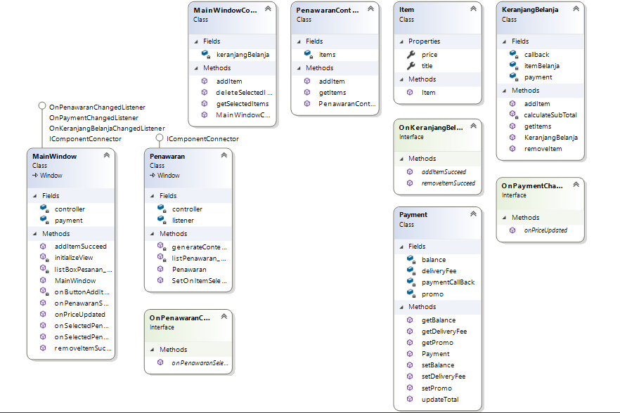

# Peran Bagian MVC
## 1.Class Diagram

## 2.Penjelasan Program
Aplikasi Sederahana untuk menambahkan item yang kita pilih ke keranjang belanja kita menggunakan metode MVC yaitu Model View Controller

## 3.Penjelasan Model
Class yang terdapat dalam model yaitu `Item.cs` `KeranjangBelanja.cs` dan `Payment.cs`.
Pada class `Item.cs` digunakan untuk membuat getter dan setter untuk item dan price, kemudian pada class `Payment.cs` digunakan untuk mengatur logic pembayaran saldo diskon ongkir dan total, selanjutnya class `KeranjangBelanja.cs` digunakan untk menampung item,menghapus item kita menggunakan list

## 4.Penjelasan View
Class yang terdapat dalam view yaitu `MainWindow.xaml.cs` dan `Penawaran.xaml.cs` yang dipergunakan untuk menampilkan atau view kepada user terhadap logic kita tadi.
`MainWindow.xaml.cs` digunakan untk menampilkan item yang sudah terpilih dari penawaran, saldo, ongkir dan total harga, Kemudian `Penawaran.xaml.cs` digunakan untk menampilkan barang yang ditawarkan yang kemudian jika barang tersebut diklik maka akan ditambahkan ke list dan ditampilkan di `MainWindow.xaml.cs`

## 5.Penjelasan Controller
Class yang terdapat dalam Controller yaitu `MainWIndowController.cs` dan `PenawaranController.cs` yang berfungsi untuk mengatur logic daripada view